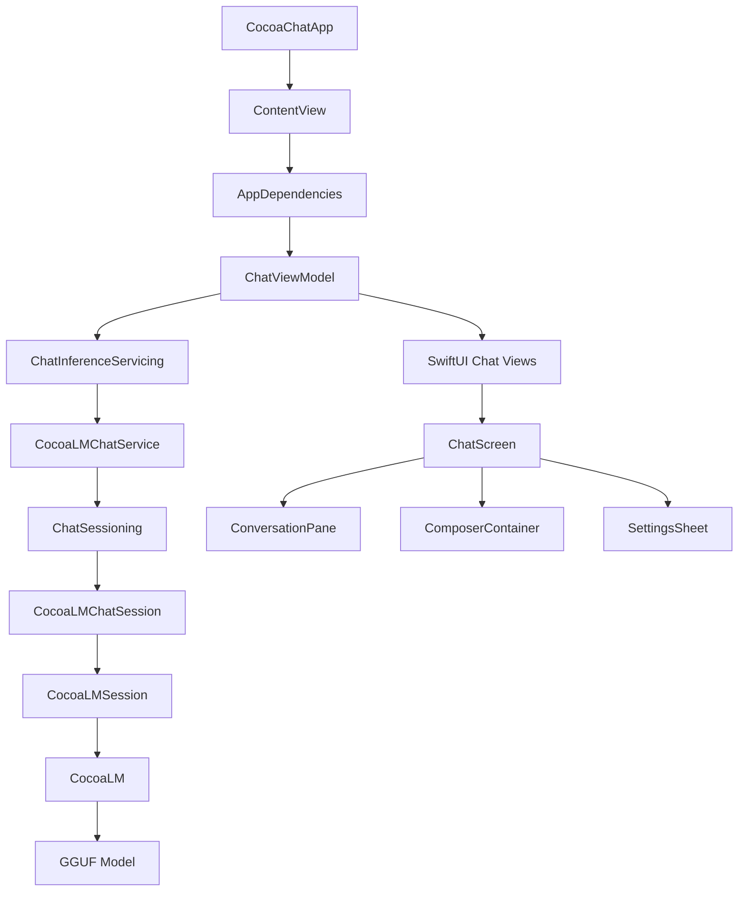
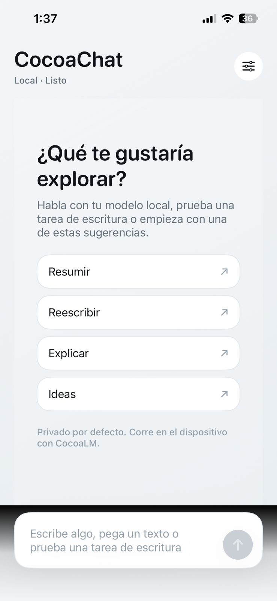
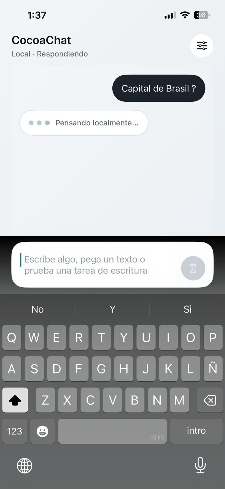
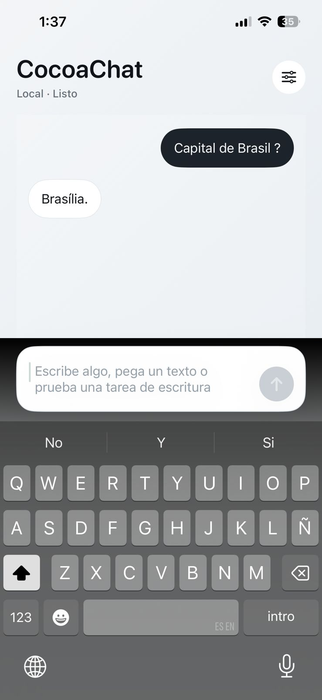
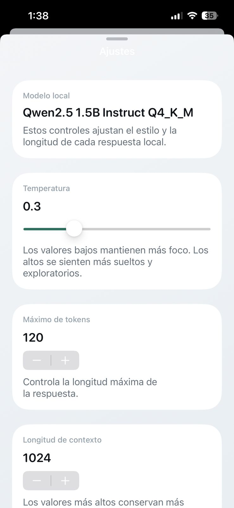
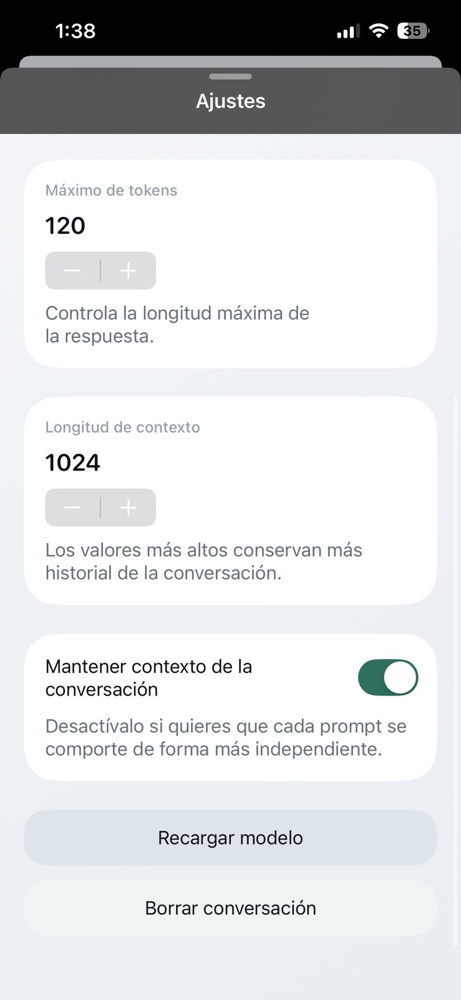

# CocoaChat

CocoaChat is a SwiftUI sample app built on top of [CocoaLM](https://github.com/JimmyDevCode/CocoaLM).

It shows a simple local chat experience on Apple platforms using:
- `CocoaLM` for model loading and text generation
- a local `GGUF` model file
- a small chat architecture with protocols and dependency injection

## What this project is

This repo is not another LLM runtime.

`CocoaChat` is the example app.
`CocoaLM` is the reusable framework behind it.

If you want the framework itself, go here:
- https://github.com/JimmyDevCode/CocoaLM

## Features

- Local chat UI built with SwiftUI
- Growing composer similar to modern chat apps
- English and Spanish UI localization
- Conversation context toggle
- Generation settings for:
  - temperature
  - max tokens
  - context length
- Service-based architecture using protocols

## Architecture

The app keeps the model runtime behind a small service boundary:

- `ChatInferenceServicing`: abstraction for chat generation
- `ChatSessioning`: abstraction for an active model session
- `CocoaLMChatService`: live implementation backed by `CocoaLM`
- `ChatViewModel`: UI state and interaction logic
- `AppDependencies`: lightweight dependency composition

That keeps `SwiftUI` views decoupled from the model runtime.



## CocoaLM integration

`CocoaChat` uses `CocoaLM` as a Swift Package dependency and creates a `CocoaLMSession` inside `CocoaLMChatService`.

Current setup:
- model catalog: `ModelCatalog.qwen15BInstructQ4`
- model strategy: `.bundleThenDocuments`
- runtime repo: https://github.com/JimmyDevCode/CocoaLM

## Screenshots







## Model file

This repo does **not** commit the `.gguf` model file.

The project ignores local model files through `.gitignore`:

```gitignore
*.gguf
```

You need to provide your own local model file.

Example filename used during development:
- `qwen2.5-1.5b-instruct-q4_k_m.gguf`

You can place it in one of these locations:
- app bundle
- app documents directory

Because the app uses `.bundleThenDocuments`, it will try the bundle first and then the documents directory.

## Getting started

1. Clone this repo.
2. Open `CocoaChat.xcodeproj`.
3. Make sure Swift Package dependencies resolve correctly.
4. Add a compatible `.gguf` model file.
5. Run the app on simulator or device.

## Recommended runtime

For the best experience, run `CocoaChat` on a physical device.

Local models can behave differently on the simulator, and real-world latency, memory pressure, and responsiveness are easier to evaluate on actual hardware.

## Notes

- `CocoaChat` is meant to demonstrate how to use `CocoaLM` in a real SwiftUI app.
- The visible UI is localized, but the internal system prompt currently stays in English.
- The app is intentionally small and focused on the chat flow rather than on persistence or multi-screen features.
